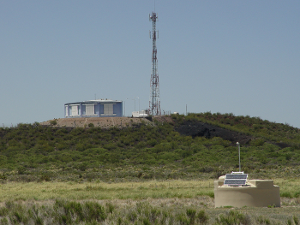

  

# auger

A collection of tools written for the Pierre Auger Observatory project:

-SpectrumUnfolder: Tool for unfolding the energy spectrum 
-CRSourceModel: Tool for fitting a cosmic ray source production model to combined spectrum and composition data
